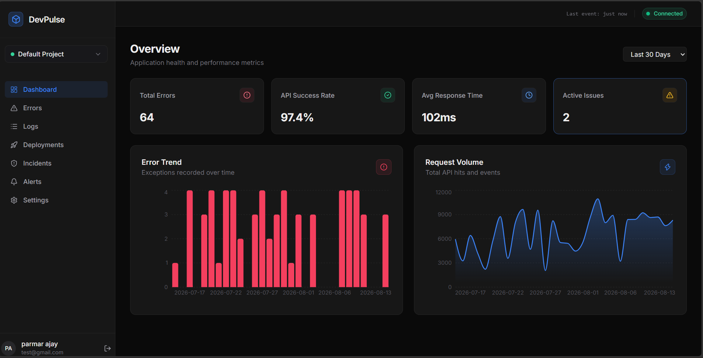
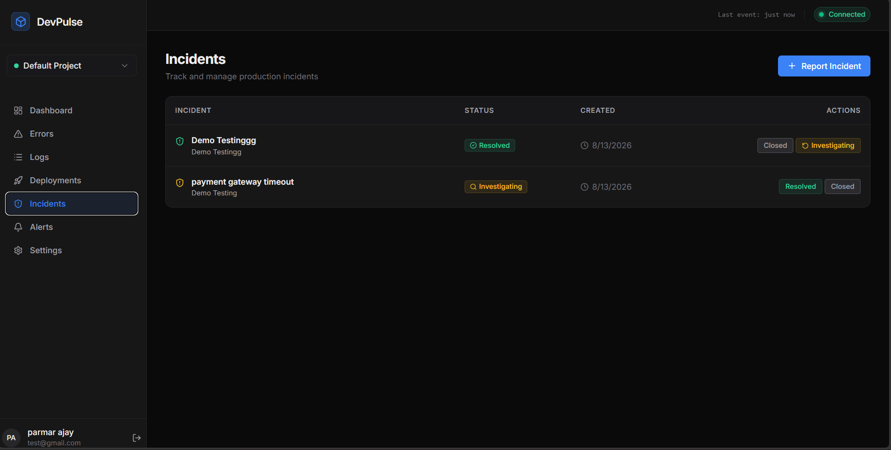
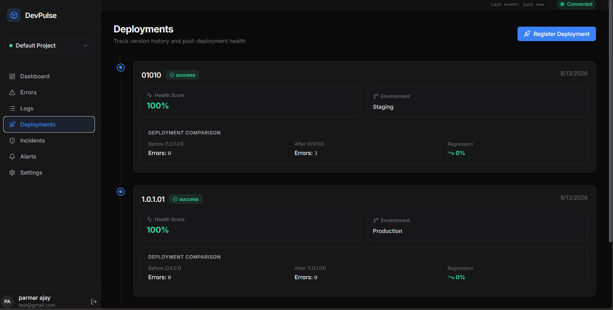

<div align="center">

# DevPulse — Engineering Productivity Developer Analytics Platform

[](https://git.io/typing-svg)

<br/>


<br/>

**[Overview](#overview)** &nbsp;·&nbsp; **[Architecture](#architecture)** &nbsp;·&nbsp; **[Tech Stack](#tech-stack)** &nbsp;·&nbsp; **[Getting Started](#getting-started)** &nbsp;·&nbsp; **[Report Bug](#)**

</div>

---

## Table of Contents

| # | Section |
|---|---------|
| 1 | [Overview](#overview) |
| 2 | [Screenshots](#screenshots) |
| 3 | [Features](#features) |
| 4 | [Tech Stack](#tech-stack) |
| 5 | [Architecture](#architecture) |
| 6 | [Real-Time Tracking](#real-time-tracking) |
| 7 | [Project Structure](#project-structure) |
| 8 | [Getting Started](#getting-started) |
| 9 | [Environment Variables](#environment-variables) |
| 10 | [Database Schema](#database-schema) |
| 11 | [Authentication and Security](#authentication-and-security) |
| 12 | [API Routes](#api-routes) |
| 13 | [Design System](#design-system) |
| 14 | [Deployment](#deployment) |
| 15 | [Roadmap](#roadmap) |
| 16 | [Contributing](#contributing) |
| 17 | [License](#license) |

---

## Overview

<div align="center">

```
================================================================================
   DevPulse is a comprehensive engineering productivity platform built with the
   MERN stack and Socket.io.

   - Real-time dashboard for errors, incidents, and deployments
   - Alert rules engine and metrics collection
   - Full timeline view for issue resolution
   - Role-Based Access Control and Organization Scoping
================================================================================
```

</div>

> **An operations platform for engineering teams to track, analyze, and improve their developer productivity.** Create projects, stream logs and error events, and build customized alerts — giving deep visibility into software reliability and engineering throughput.

### Why This Project?

| Common Pain Points | DevPulse |
|:----------------------|:-----------------|
| Scattered toolset for logs, errors, and deployments | Centralized dashboard for the entire software lifecycle |
| Difficulty tracking incident resolution time | Dedicated incident management with historical timelines |
| Unknown impact of deployments on system stability | Correlated metrics linking deployments to error spikes |
| Latency in notification loops | WebSockets power real-time updates directly to the UI |
| Blind spots in API rate limits and performance | Granular logging and ingestion API for full observability |
| Inflexible metrics | Hourly and daily aggregations out-of-the-box via cron jobs |

### Built For

```
Engineering Leaders who need visibility into system health and deployment velocity
DevOps / SRE teams managing alerts and incident lifecycles
Full-stack engineers seeking a cohesive operations hub
Developers learning real-time dashboard patterns, WebSockets, and metric aggregations
```

---

## Screenshots

<div align="center">

<h3>Dashboard</h3>


<br/>

<h3>Alert Rules</h3>


<br/>

<h3>Incidents</h3>


<br/>

<h3>Deployment Tracking</h3>


<br/>

<h3>Error Feed</h3>


<br/>

<h3>Logs Explorer</h3>


<br/>

<h3>Organization Settings</h3>


</div>

---

## Features

<details open>
<summary><h3>Error & Log Ingestion Engine</h3></summary>

| Feature | Where | How It Works |
|---------|-------|---------------|
| **High-Volume Ingestion API** | `ingestController.ts` | Scalable endpoints to receive errors, structured logs, API telemetry, and performance metrics. |
| **Error Grouping & Fingerprinting** | `ErrorGroup` & `ErrorEvent` | Incoming errors are hashed by message, stack trace, and endpoint to generate a unique fingerprint. Identical errors are grouped together for easier triaging. |
| **Idempotency** | MongoDB `11000` Errors | Handles retries gracefully; if the SDK sends the same event ID twice due to a network glitch, the duplicate is ignored without throwing 500s. |

</details>

<details>
<summary><h3>Monitoring, Analytics & Time-Series</h3></summary>

| Feature | Where | How It Works |
|---------|-------|---------------|
| **Time-Series Aggregation** | `statsController.ts`, Cron Jobs | Background Node-Cron jobs summarize high-volume event data into `HourlyMetric` and `DailyMetric` models to ensure dashboard queries for '24h', '7d', and '30d' ranges return instantly. |
| **Performance Metrics** | `PerformanceMetric` model | Ingests and aggregates latency, throughput, and custom system metrics. Provides Core Web Vitals tracking (LCP, CLS, pageLoadTime). |
| **Dashboard Statistics** | `statsController.ts` | Calculates complex rolling aggregates on the fly, showing Error Trends, Request Volumes, API Success Rates, and Average Response Times. |

</details>

<details>
<summary><h3>Real-Time Operations & WebSockets</h3></summary>

| Feature | Where | How It Works |
|---------|-------|---------------|
| **Live Updates via WebSockets** | `socket.io` | Bi-directional WebSockets push new errors, deployment statuses, and incident updates to connected frontend clients instantly without polling overhead. |
| **Incident Management** | `Incident` model & Controller | Automated or manual creation of incidents with assigned severity levels and status updates. Maintain historical incident timelines. |
| **Alert Rules Engine** | `alertController.ts` | Configurable thresholds that trigger notifications (e.g., Email via Nodemailer) when error volume or latency conditions are met. |

</details>

<details>
<summary><h3>Multi-Tenant Architecture & Security</h3></summary>

| Feature | Where | How It Works |
|---------|-------|---------------|
| **Organization Isolation** | `Organization` model & Middleware | Projects and data are scoped to multi-tenant organizations to prevent cross-tenant leaks. All MongoDB queries validate `organizationId`. |
| **Role-Based Access Control** | Auth Middleware | Enforces user permissions based on their role in a given organization (e.g., Admin, Member, Viewer). |
| **JWT Authentication** | `authController.ts` | Stateless authentication handling login, registration, and protected API routes. |
| **Ingest Rate Limiting** | `RateLimit` model | Organizations have defined usage plans and event limits. API limits are enforced automatically based on their monthly quota. |

</details>

<details>
<summary><h3>Project & Deployment Management</h3></summary>

| Feature | Where | How It Works |
|---------|-------|---------------|
| **Project Management** | `Project` model & Controller | Create, edit, and organize projects within an organization to separate application streams. |
| **Deployment Tracking** | `Deployment` model & Controller | Track version releases. Correlate releases with spikes in error rates or shifts in performance by mapping deployments onto metric charts. |

</details>

<details>
<summary><h3>Frontend Interface & Visualizations</h3></summary>

| Feature | Implementation |
|---------|-----------------|
| **Modern Dashboard** | React + Tailwind CSS with modular component design, utilizing dark/glassmorphism design cues. |
| **State Management** | Redux Toolkit and React Query working together to manage complex server state and offline caching. |
| **Data Visualization** | Recharts library for rendering beautiful metrics and trend lines for 30-day API metrics and error volumes. |
| **Command Palette & Interactions** | `cmdk` for quick `Cmd+K` global actions, augmented by Framer Motion for subtle transitions. |

</details>

---

## Tech Stack

<div align="center">

### Backend


### Frontend
-20232A?style=flat-square&logo=react&logoColor=61DAFB)


</div>

| Category | Package | Purpose |
|----------|---------|---------|
| **Server** | express | Core REST API framework — non-blocking I/O |
| **Database** | mongodb / mongoose | Flexible schemas for high-volume logs and metrics |
| **Real-Time** | socket.io | Pushes live data to the UI without polling |
| **Validation** | zod | Runtime validation on every request body |
| **Auth** | jsonwebtoken, bcryptjs | Stateless JWT auth, salted password hashing |
| **Background Tasks** | node-cron | Hourly/daily aggregations and cleanup scripts |
| **Frontend build** | vite | Fast dev server and HMR |
| **State Management** | @reduxjs/toolkit / @tanstack/react-query | Client state and async server state caching |
| **Charts** | recharts | Analytics dashboard visualizations |
| **Command menu** | cmdk | Global command palette for power users |

---

## Architecture

```
                    +-------------------------------+
                    |         React Frontend         |
                    | Vite - TailwindCSS - Recharts  |
                    +---------------+-----------------+
                                    |  REST API + WebSockets
                +-------------------v-------------------+
                |            Express Server               |
                |   Auth Middleware - RBAC Middleware      |
                |       Socket.io Real-Time Engine         |
                +------+--------------------+-------------+
                       |                    |
        +--------------v--+      +----------v-------------+
        |    MongoDB       |      |     Background         |
        |  (via Mongoose)  |      |     Cron Jobs          |
        |  Errors, Logs,   |      |  (Data Aggregation)    |
        |  Deployments, ...|      +-------------------------+
        +------------------+
```

### Data Flow Example: Ingesting an Error

```
  +----------+    +----------------+    +------------------+    +-----------+
  |  SDK /   |--->|  POST          |--->|  Validate Schema |--->|  Ingest   |
  |  Client  |    |  /ingest/error |    |  with Zod        |    | Controller|
  +----------+    +----------------+    +------------------+    +-----+-----+
                                                                       |
       +---------------------------------------------------------------v---+
       |  Group error by stack trace -> Save to ErrorEvent / ErrorGroup     |
       +---------------------------------------------------------------+---+
                                                                       |
       +---------------------------------------------------------------v---+
       |  Evaluate AlertRules -> If threshold met, dispatch Email via Cron  |
       +---------------------------------------------------------------+---+
                                                                       |
       +---------------------------------------------------------------v---+
       |  Socket.io broadcasts 'new_error' event -> Frontend updates live   |
       +-----------------------------------------------------------------+
```

---

## Real-Time Tracking

**Why WebSockets?** Instead of the frontend constantly polling for new errors or deployment state changes, DevPulse uses Socket.io to push updates only when they happen.

1. **Live Dashboard Updates** — When an error is ingested or a deployment succeeds, a WebSocket event is fired.
2. **Instant Incident Awareness** — Teams viewing the dashboard will see new incidents appear instantly, reducing time-to-resolution.

---

## Project Structure

```
DevPulse/
|-- backend/
|   |-- src/
|   |   |-- controllers/         # alert, auth, error, incident, etc.
|   |   |-- jobs/                # node-cron tasks for aggregation
|   |   |-- middlewares/         # auth, validation
|   |   |-- models/              # AlertRule, ErrorEvent, Incident, Organization
|   |   |-- routes/              # API route definitions
|   |   |-- services/            # Core business logic
|   |   |-- utils/               # Helpers
|   |   |-- validators/          # Zod schemas
|   |   +-- index.ts             # Express & Socket app entry point
|   +-- package.json
+-- frontend/
    |-- src/
    |   |-- components/          # Shared UI elements
    |   |-- features/            # alerts, analytics, dashboard, errors, etc.
    |   |-- hooks/               # Custom React hooks
    |   |-- services/            # API client calls
    |   |-- store/               # Redux configuration
    |   |-- utils/               # Formatters, helpers
    |   |-- App.tsx              # Router config
    |   +-- main.tsx             # React DOM mount
    +-- package.json
+-- packages/
    |-- test-sdk.js              # Example SDK usage
```

---

## Getting Started

### Prerequisites

```bash
node        >= 18.0.0
npm / pnpm
MongoDB URI  - local or Atlas
```

### Installation

```bash
# 1. Clone the repository
git clone https://github.com/your-username/devpulse.git
cd devpulse

# 2. Backend setup
cd backend
npm install
cp .env.example .env   # fill in your values, see below
npm run dev

# 3. Frontend setup (in a new terminal)
cd ../frontend
npm install
cp .env.example .env
npm run dev
```

The frontend runs at [http://localhost:5173](http://localhost:5173), the API at `http://localhost:5000`.

---

## Environment Variables

**Backend (`backend/.env`)**

```env
PORT=5000
MONGODB_URI=your_mongodb_connection_string
JWT_SECRET=your_super_secret_jwt_key
JWT_EXPIRES_IN=7d
```

**Frontend (`frontend/.env`)**

```env
VITE_API_URL=http://localhost:5000/api/v1
```

| Variable | Required | Purpose |
|----------|:--------:|---------|
| `PORT` | No | Server port (default 5000) |
| `MONGODB_URI` | Yes | Database connection string |
| `JWT_SECRET` | Yes | Signs and verifies auth tokens |
| `JWT_EXPIRES_IN` | Yes | Token lifetime (default `7d`) |
| `VITE_API_URL` | Yes | Base URL the frontend calls |

> **Never commit your `.env` file.** Use `.env.example` as the template only.

---

## Database Schema

All models are defined with Mongoose in `backend/src/models/`.

<details open>
<summary><strong>User & Organization</strong></summary>

| Model | Purpose |
|-------|---------|
| `User` | Stores identity, hashed password, and profile. |
| `Organization` | The multi-tenant boundary for projects and members. |
| `Project` | Belongs to an organization, groups errors and deployments. |

</details>

<details>
<summary><strong>Events & Errors</strong></summary>

| Model | Purpose |
|-------|---------|
| `ErrorGroup` | Groups identical errors by stack trace or message signature. |
| `ErrorEvent` | A specific instance/occurrence of an error. |
| `Log` | Structured log entries ingested from applications. |

</details>

<details>
<summary><strong>Operations & Metrics</strong></summary>

| Model | Purpose |
|-------|---------|
| `Deployment` | Tracks releases, commits, and version changes. |
| `Incident` | Represents a service outage or issue, with timeline steps. |
| `AlertRule` | User-defined conditions that trigger notifications. |
| `PerformanceMetric` | Raw telemetry for API response times and throughput. |
| `HourlyMetric` / `DailyMetric` | Pre-aggregated data points for fast dashboard querying. |

</details>

---

## Authentication and Security

### Route Protection

| Layer | Enforces |
|-------|----------|
| 1. `requireAuth` | Valid, unexpired JWT present |
| 2. `requireOrgAccess` | (Where applicable) User is a member of the requested organization |
| 3. Rate Limiting | The `RateLimit` model tracks and blocks abusive ingestion traffic |

### Security Notes

- Zod validates every request body before it reaches a controller.
- Passwords are hashed with `bcryptjs`; raw passwords are never stored or logged.
- Helmet is used for securing HTTP headers in Express.

---

## API Routes

| Method | Endpoint | Auth | Description |
|:------:|----------|:----:|-------------|
| POST | `/api/v1/auth/register` | No | Create account |
| POST | `/api/v1/auth/login` | No | Issue JWT |
| POST | `/api/v1/ingest/error` | Token | Send a new error event |
| POST | `/api/v1/ingest/log` | Token | Stream a structured log |
| GET | `/api/v1/projects` | Yes | List projects |
| GET | `/api/v1/errors` | Yes | List error groups |
| GET | `/api/v1/incidents` | Yes | List active incidents |
| GET | `/api/v1/deployments` | Yes | Deployment history |
| GET | `/api/v1/stats/overview` | Yes | Get aggregated dashboard metrics |

> Check the `routes/` directory for exhaustive and up-to-date endpoints.

---

## Design System

DevPulse uses a modern, data-dense interface built for engineering teams. It leverages Tailwind CSS and customized UI components to present charts, logs, and timelines clearly. Framer Motion is utilized for layout transitions, and Redux manages the complex state required by deep data views. 

---

## Deployment

- **Frontend:** Vercel or Netlify (static Vite build)
- **Backend:** Render, Railway, or Fly.io — persistent server required for WebSockets and cron jobs.
- **Database:** MongoDB Atlas

---

## Roadmap

**Core Features**
- [x] Real-time error ingestion and grouping
- [x] WebSocket dashboard updates
- [x] Deployment and incident tracking
- [x] Basic cron aggregations for charting
- [x] Organization and project structures

**Planned**
- [ ] Advanced alert integrations (Slack, PagerDuty, Webhooks)
- [ ] Source map support for minified JavaScript errors
- [ ] Advanced custom dashboards with drag-and-drop widgets
- [ ] Machine learning-based anomaly detection on metrics

---

## Contributing

```bash
# 1. Fork the repository
# 2. Create your feature branch
git checkout -b feature/amazing-feature

# 3. Commit your changes
git commit -m "feat: add amazing feature"

# 4. Push and open a Pull Request
git push origin feature/amazing-feature
```

### Code Style

- Zod schemas for every request body
- Strict TypeScript configurations
- Shared UI components for consistency

---

## License

Distributed under the **MIT License**.

---


<div align="center">

**Built with the MERN stack and Socket.io**

[](https://github.com/parmarajay2712)
[](https://linkedin.com/in/ajayparmar27)

<br/>

**Star this repo if it helped you — it means a lot!**

</div>
